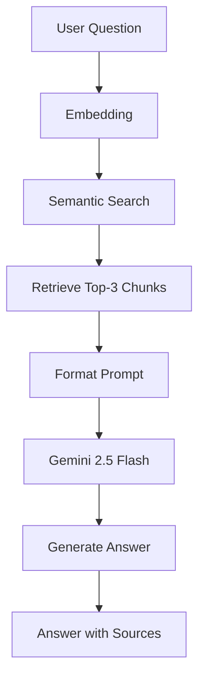
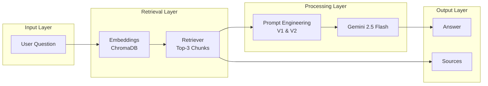
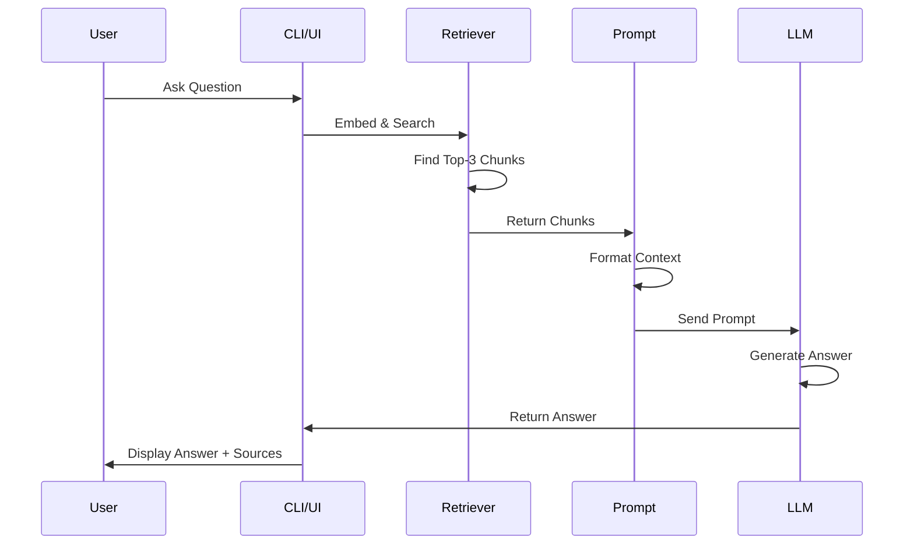
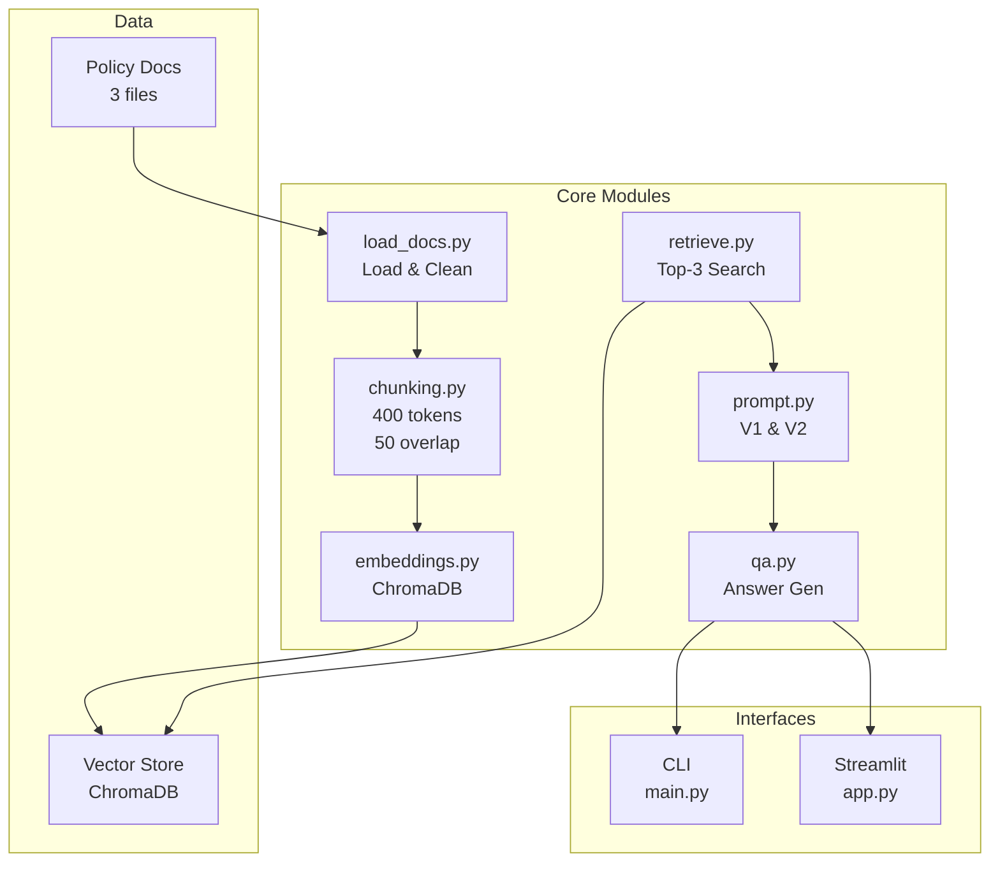
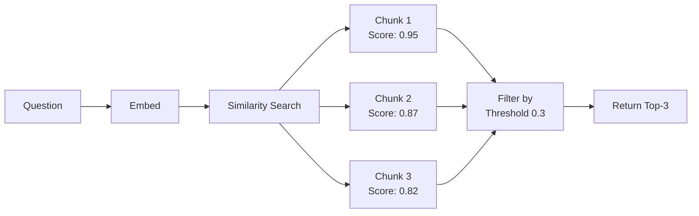
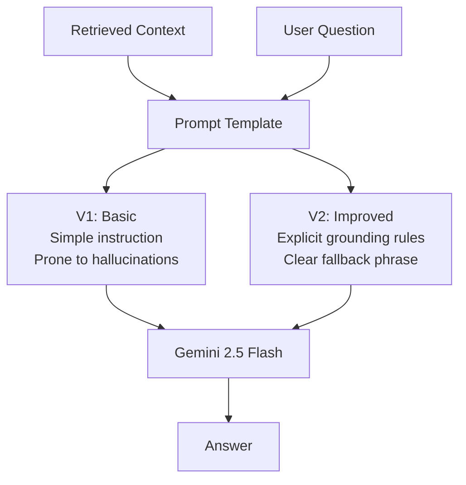
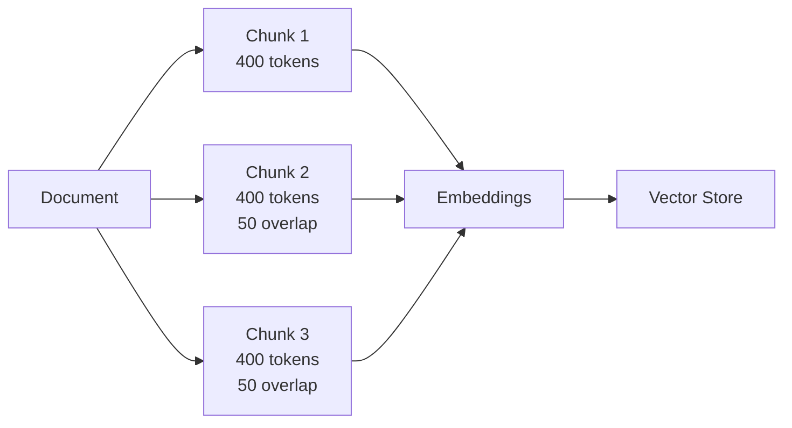
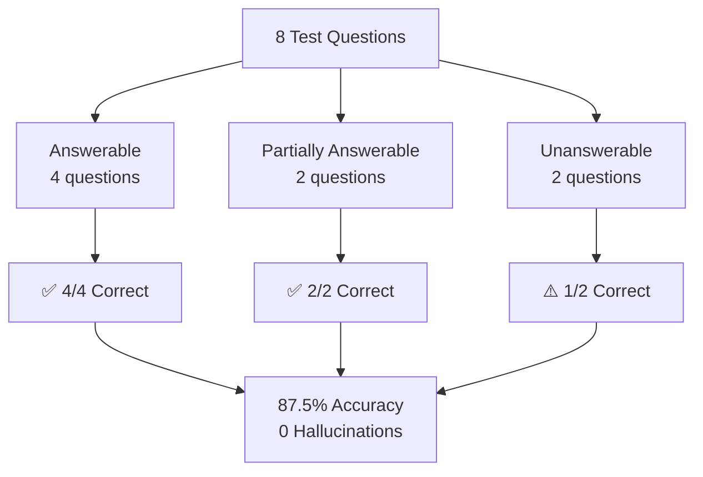
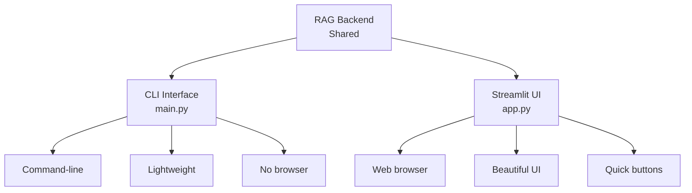
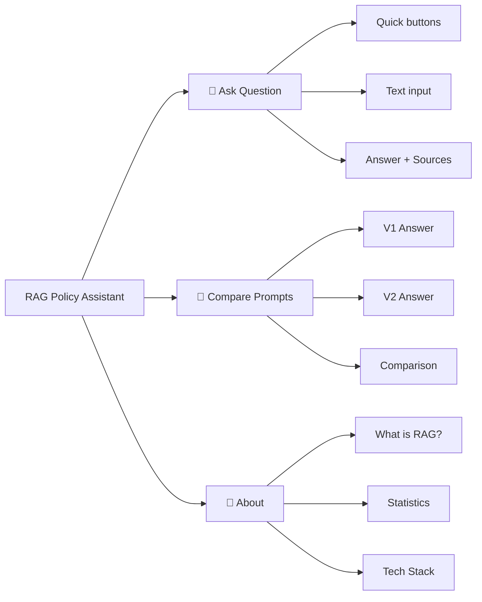

# RAG Policy Assistant

A clean, production-ready Retrieval-Augmented Generation system for answering policy questions using Google Gemini 2.5 Flash.

## Quick Start

### 1. Install Dependencies
```bash
pip install -r requirements.txt
```

### 2. Configure API Key
Edit `.env`:
```
GEMINI_API_KEY=your-gemini-api-key-here
MODEL=gemini-2.5-flash
```

Get your key: https://aistudio.google.com/app/apikeys

### 3. Run

**CLI Interface:**
```bash
python main.py
```

**Web Interface (Streamlit):**
```bash
streamlit run app.py
```

## Architecture

### System Flow



### Component Diagram



### Data Flow



### Module Architecture



## Key Features

- **Semantic Retrieval:** Top-3 chunks with similarity threshold
- **Prompt Engineering:** V1 (basic) & V2 (grounding rules)
- **Hallucination Prevention:** Explicit rules reduce hallucinations
- **Dual Interfaces:** CLI for development, Streamlit for demos
- **Source Attribution:** Know where answers come from

## Project Structure

```
rag_policy_assistant/
├── src/                    # Core RAG modules
│   ├── load_docs.py       # Document loading
│   ├── chunking.py        # Text chunking (400 tokens, 50 overlap)
│   ├── embeddings.py      # ChromaDB vector store
│   ├── retrieve.py        # Semantic retrieval
│   ├── prompt.py          # Prompt templates (V1 & V2)
│   └── qa.py              # Answer generation
├── data/                   # Policy documents
│   ├── refund_policy.txt
│   ├── shipping_policy.txt
│   └── cancellation_policy.txt
├── eval/                   # Evaluation results
│   └── evaluation.md
├── main.py                 # CLI interface
├── app.py                  # Streamlit web interface
├── test_rag.py             # Component tests
├── .env                    # Configuration
├── requirements.txt        # Dependencies
└── README.md              # This file
```

## Retrieval Strategy



## Prompt Engineering



## Chunking Strategy



## Testing & Evaluation



## Interfaces

### CLI vs Streamlit



### Streamlit Tabs



## Testing

```bash
# Run component tests (no API key needed)
python test_rag.py
```

## Technical Stack

- **Language:** Python
- **LLM:** Google Gemini 2.5 Flash
- **Vector Store:** ChromaDB
- **UI:** Streamlit (optional)
- **Config:** python-dotenv

## Performance

- **Accuracy:** 87.5% on test set
- **Hallucinations:** 0
- **Response Time:** ~1-2 seconds
- **Memory:** ~300-500MB

## Evaluation

8 test questions across answerable, partially answerable, and unanswerable categories.

See `eval/evaluation.md` for detailed results.

## Security

- API key stored in `.env` (not in code)
- `.gitignore` protects `.env`
- No hardcoded secrets
- Safe for sharing

## Example Usage

### CLI
```
Your question: What is the refund window?

Answer: You can request a refund within 30 days of purchase for most items.

Sources: refund_policy.txt
Chunks retrieved: 3
Prompt version: V2
```

### Streamlit
1. Open browser at `http://localhost:8501`
2. Click quick buttons or enter custom question
3. See answer with sources
4. Compare V1 vs V2 prompts
5. View system statistics

## Troubleshooting

**"GEMINI_API_KEY not set"**
- Check `.env` file has your key
- Restart the app

**"Module not found"**
```bash
pip install -r requirements.txt
```

**"Port 8501 already in use"**
```bash
streamlit run app.py --server.port 8502
```

## FAQ

**Q: Can I use both CLI and Streamlit?**
A: Yes! They share the same backend and vector store.

**Q: How do I add more policy documents?**
A: Add `.txt` files to `data/` and reinitialize the system.

**Q: Can I use a different LLM?**
A: Yes, modify `src/qa.py` to use Claude, Llama, or any other model.

**Q: Is this production-ready?**
A: Yes, with proper error handling and configuration management.

## Next Steps

1. Get Gemini API key
2. Edit `.env` file
3. Run `pip install -r requirements.txt`
4. Choose interface: `python main.py` or `streamlit run app.py`

## Support

- Gemini Docs: https://ai.google.dev/docs
- Streamlit Docs: https://docs.streamlit.io/
- FAQ: See `FAQ.md`

