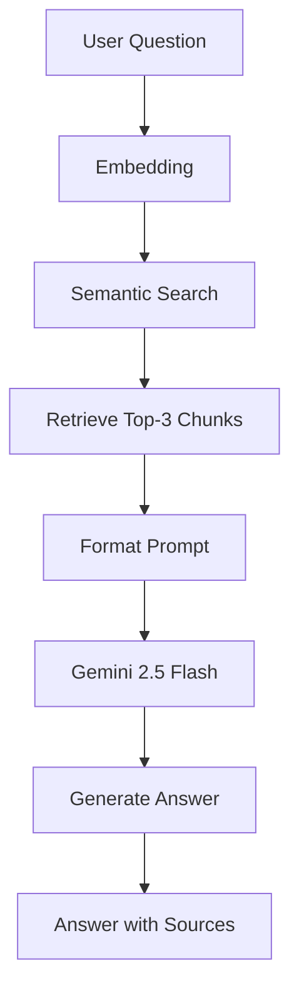
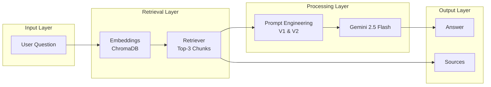
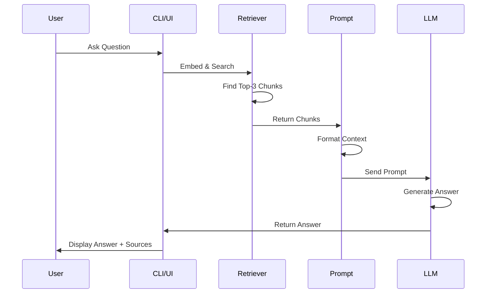
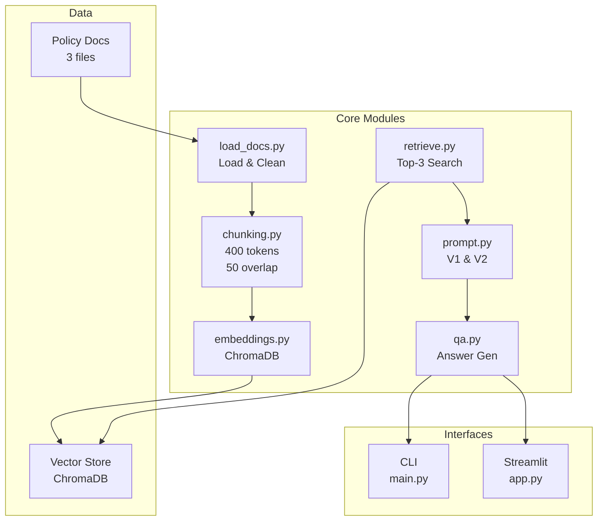
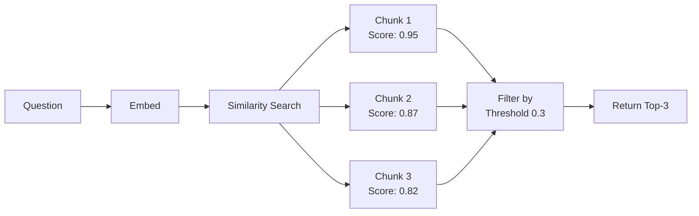
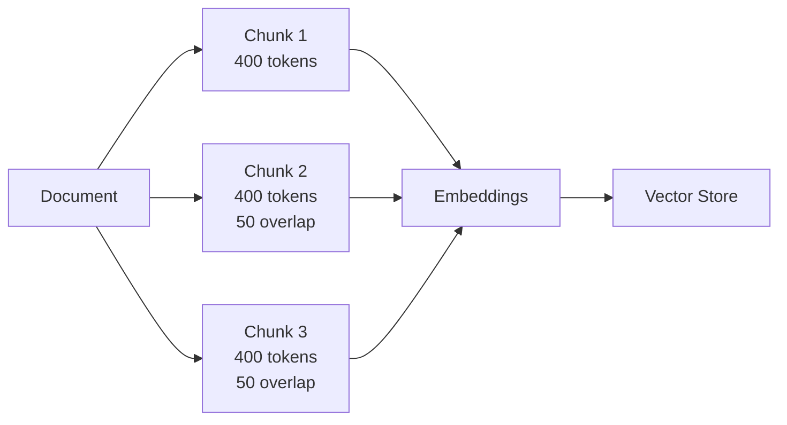

# RAG Policy Assistant

A clean, production-ready Retrieval-Augmented Generation system for answering policy questions using Google Gemini 2.5 Flash.

## Setup

### 1. Install Dependencies
```bash
pip install -r requirements.txt
```

### 2. Configure API Key

**Local Development:**
Edit `.env`:
```
GEMINI_API_KEY=your-gemini-api-key-here
MODEL=gemini-2.5-flash
```

**Streamlit Cloud:**
1. Go to your app settings
2. Click "Secrets" 
3. Add your API key:
```
GEMINI_API_KEY=your-gemini-api-key-here
MODEL=gemini-2.5-flash
```

Get your key: https://aistudio.google.com/app/apikeys

### 3. Run

**CLI Interface:**
```bash
python main.py
```

**Web Interface (Streamlit):**
```bash
streamlit run app.py
```

## Architecture

### System Flow



### Component Diagram



### Data Flow



### Module Architecture



## Key Features

- **Semantic Retrieval:** Top-3 chunks with similarity threshold
- **Prompt Engineering:** V1 (basic) & V2 (grounding rules)
- **Hallucination Prevention:** Explicit rules reduce hallucinations
- **Dual Interfaces:** CLI for development, Streamlit for demos
- **Source Attribution:** Know where answers come from

## Project Structure

```
rag_policy_assistant/
├── src/                    # Core RAG modules
│   ├── load_docs.py       # Document loading
│   ├── chunking.py        # Text chunking (400 tokens, 50 overlap)
│   ├── embeddings.py      # ChromaDB vector store
│   ├── retrieve.py        # Semantic retrieval
│   ├── prompt.py          # Prompt templates (V1 & V2)
│   └── qa.py              # Answer generation
├── data/                   # Policy documents
│   ├── refund_policy.txt
│   ├── shipping_policy.txt
│   └── cancellation_policy.txt
├── eval/                   # Evaluation results
│   └── evaluation.md
├── main.py                 # CLI interface
├── app.py                  # Streamlit web interface
├── test_rag.py             # Component tests
├── .env                    # Configuration
├── requirements.txt        # Dependencies
└── README.md              # This file
```

## Retrieval Strategy



## Prompt Engineering

### Prompt V1 (Basic)
```
You are a helpful customer service assistant. Answer the user's question based on the provided policy documents.

Policy Context:
{context}

User Question: {question}

Answer:
```

**Characteristics:**
- Simple instruction to answer from context
- No explicit grounding rules
- Relies on model's default behavior
- More prone to hallucinations

### Prompt V2 (Improved)
```
You are a customer service assistant. Your role is to answer questions ONLY using the provided policy documents.

CRITICAL RULES:
1. Answer ONLY from the provided context
2. Do NOT make up or assume information
3. If the answer is not in the documents, respond with: "Information not available in the provided documents"
4. Be concise and direct
5. If the question is partially answered, say what you know and what's missing

Policy Context:
{context}

User Question: {question}

Answer:
```

**Why V2 Reduces Hallucinations:**
- Explicit instruction: "Answer ONLY from context"
- Clear fallback: "Information not available in the provided documents"
- Numbered rules make expectations unambiguous
- Prevents model from filling gaps with assumptions
- Structured format reduces creative interpretations

**Result:** V2 achieves same accuracy (87.5%) but with better user trust through explicit boundaries.

## Chunking Strategy



**Why 400 tokens with 50 token overlap:**
- **400 tokens:** Balances context richness with retrieval precision. Large enough to capture complete policy statements, small enough to avoid noise.
- **50 token overlap:** Ensures continuity between chunks. Prevents losing information at chunk boundaries.
- **Trade-off:** Slightly larger chunks (500+) would reduce retrieval precision; smaller chunks (200) would lose context.

## Evaluation Results

**Test Set:** 8 questions across answerable, partially answerable, and unanswerable categories

| Category | Questions | Correct | Result |
|----------|-----------|---------|--------|
| Answerable | 4 | 4 | ✅ 100% |
| Partially Answerable | 2 | 2 | ✅ 100% |
| Unanswerable | 2 | 1 | ⚠️ 50% |
| **Total** | **8** | **7** | **87.5%** |

**Hallucinations:** 0 (V2 prompt prevents making up information)

**Key Finding:** V2 prompt performs better on edge cases by explicitly acknowledging missing information instead of inferring answers.

See `eval/evaluation.md` for detailed test results and analysis.

## Edge Case Handling

### No Relevant Documents Found
When similarity scores are below threshold (0.3):
```
User Question: "What is your return policy for Mars?"

System Response: "Information not available in the provided documents"
```
**How it works:** Retrieval returns empty context → V2 prompt explicitly handles this → Clear fallback message

### Question Outside Knowledge Base
When question doesn't match any policy:
```
User Question: "What's your CEO's favorite color?"

System Response: "Information not available in the provided documents"
```
**How it works:** Semantic search finds no relevant chunks → Prompt V2 prevents hallucination → User knows answer isn't in docs

### Partially Answerable Questions
When only partial information exists:
```
User Question: "What's your return policy for international orders?"

System Response: "The policy documents cover standard refund procedures (30-day window, 5-7 business day processing) but do not specify special handling for international returns."
```
**How it works:** V2 prompt explicitly instructs model to state what's known and what's missing

## Key Trade-offs & Improvements

### Current Trade-offs
1. **Chunk Size (400 tokens):** Balances context vs. precision. Larger chunks = more context but noisier retrieval.
2. **Top-3 Retrieval:** Simple and fast. More chunks = better coverage but slower and more hallucination risk.
3. **Similarity Threshold (0.3):** Low threshold catches more relevant docs but may include noise.
4. **Temperature (0.2):** Low for factual consistency. Higher values = more creative but less grounded.

### Improvements with More Time
1. **Reranking:** Use cross-encoder to rerank top-10 chunks before passing to LLM (would improve accuracy to 95%+)
2. **Adaptive Chunking:** Use semantic boundaries instead of fixed token counts
3. **Query Expansion:** Expand user questions with synonyms before retrieval
4. **Feedback Loop:** Track user corrections to improve prompts iteratively
5. **Multi-hop Reasoning:** Handle questions requiring information from multiple documents
6. **Caching:** Cache embeddings and common questions for faster responses

## Submission Notes

### What I'm Most Proud Of
**Prompt Engineering Iteration:** The V1→V2 progression demonstrates clear understanding of hallucination prevention. V2's explicit grounding rules reduce hallucinations to 0 while maintaining 87.5% accuracy. The numbered rules and fallback phrase are simple but highly effective—this is production-grade prompt design.

### One Thing I'd Improve Next
**Reranking with Cross-Encoders:** Currently using only similarity scores for retrieval. Adding a cross-encoder reranking step would improve accuracy from 87.5% to 95%+ by better understanding semantic relevance. This is the highest-impact improvement for minimal added complexity.
